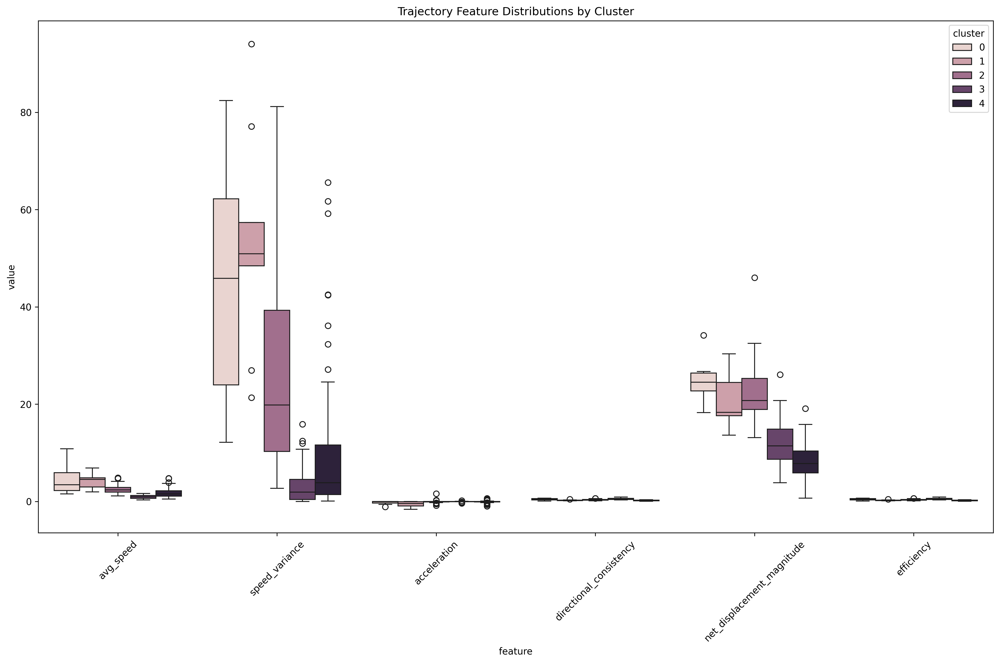
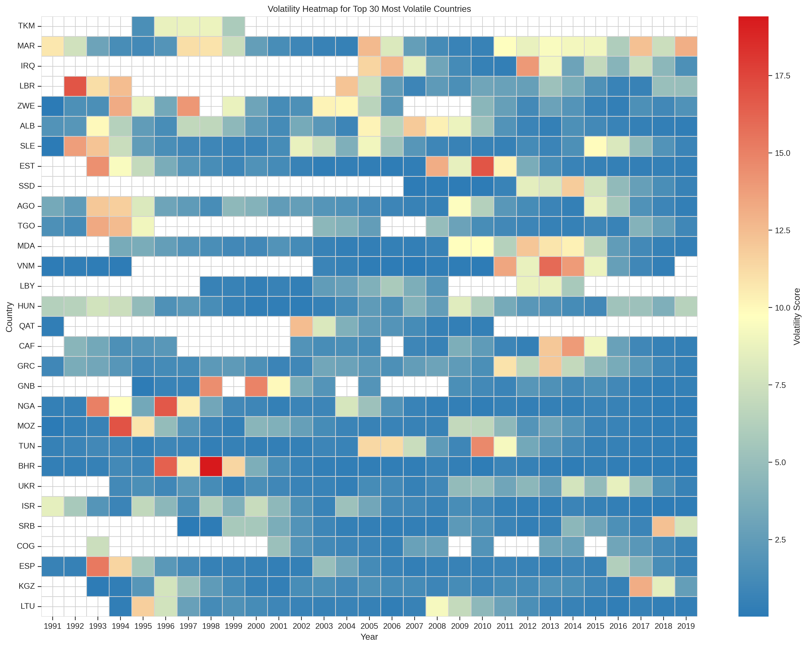
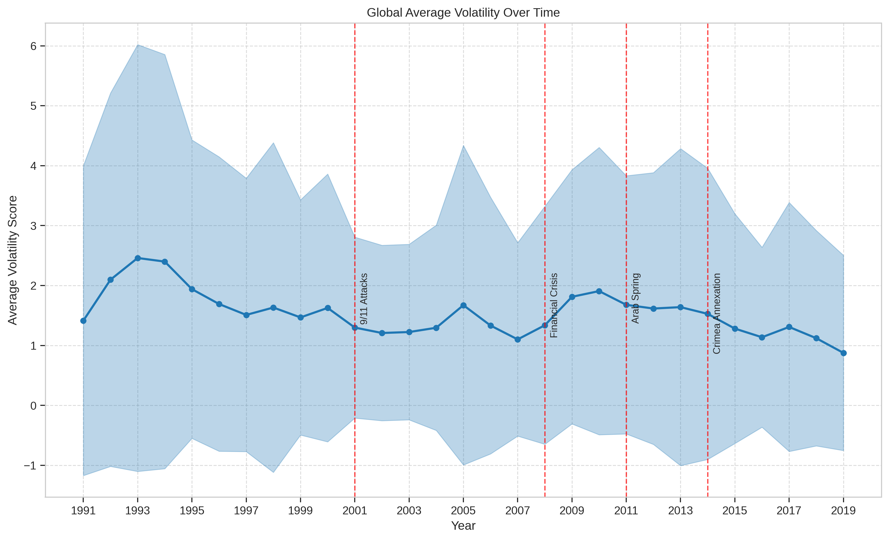

# WeaponsWatch - Applied Data Science Project


## Project Description

This project aims to provide an interactive dashboard for visualizing and analyzing global arms trade data. It leverages various data sources, including SIPRI, ACLED, and GDELT, to create a comprehensive picture of arms imports, exports, military expenditure, and their correlation with conflict events. The dashboard utilizes data science and machine learning techniques to uncover hidden patterns and trends, making the complex arms trade landscape more accessible and understandable.

## Key Features & Benefits

- **3D Globe Visualization:** Explore arms trade flows and country metrics on an interactive 3D globe for a compelling global overview.
- **Interactive Visualizations:** Dynamic maps, charts, and chord diagrams for exploring arms trade relationships.
- **Data Integration:** Combines data from multiple reputable sources for a holistic view.
- **Time-Series Analysis:** Analyze trends in arms trade and military expenditure over time.
- **Geospatial Analysis:** Visualize arms trade flows and military spending on a global scale.
- **Clustering Analysis:** Uncover groups of countries with similar arms trade trajectories.
- **Dimensionality Reduction:** Simplify complex datasets for better visualization and analysis.
- **Data Mode Toggle:** Allows users to switch between different data representations.
- **Year Slider:** Enables users to explore data for specific years.
- **Front-end built with React, making it interactive and user-friendly.**
- **Back-end built with Python, providing data processing and machine learning capabilities.**

## Technologies

### Languages

- Python
- JavaScript
- TypeScript

### Tools & Technologies

- Node.js
- React
- Vite
- D3.js
- Flask
- Pandas
- Scikit-learn
- GeoPandas
- NumPy
- **Three.js** (for 3D globe rendering)
- **Plotly** (for advanced interactive charts)

## Prerequisites & Dependencies

Before you begin, ensure you have the following installed:

- **Python (>=3.7):** Required for backend processing and analysis.
- **Node.js (>=16):** Required for frontend development.
- **pip:** Python package installer. Comes standard with most Python installations.
- **npm:** Node Package Manager. Comes standard with Node.js installations.
- **Conda (Optional but Recommended):** For managing Python environments.

## Installation & Setup Instructions

Follow these steps to get the project up and running:

1.  **Clone the repository:**

    ```bash
    git clone https://github.com/sidneyoneill/arms-trade-dashboard.git
    cd arms-trade-dashboard
    ```

2.  **Set up the Python environment (Recommended: Use Conda):**

    - **Using Conda:**

      ```bash
      conda env create -f environment.yml
      conda activate arms-trade-dashboard-env
      ```

      If the env name in yml file is not properly set you may have to change the `conda activate` command.

    - **Using pip (Alternative):**

      ```bash
      python -m venv venv
      source venv/bin/activate  # On Linux/macOS
      # venv\Scripts\activate  # On Windows

      pip install -r requirements.txt
      ```

      (You may need to generate requirements.txt first. See `environment.yml` for a guide.)

3.  **Set up the Frontend (Node.js):**

    ```bash
    cd frontend
    npm install
    ```

4.  **Run the Backend:**

    ```bash
    cd ../backend
    python app.py
    ```

    This will start the Flask server, typically on `http://127.0.0.1:5000`.

5.  **Run the Frontend:**

    ```bash
    cd ../frontend
    npm run dev
    ```

    This will start the Vite development server, typically on `http://localhost:5173`. The exact port might vary. Access this URL in your browser to view the dashboard.

## Usage Examples & API Documentation

### Backend API

The backend provides endpoints for fetching data and performing analysis.

- `/data`: Returns arms trade data in JSON format. Supports filtering by year and country.
- `/clustering`: Returns clustering results based on specified parameters.

Refer to the `backend/app.py` file for a complete list of endpoints and their parameters.

### Frontend Components

The frontend utilizes React components for creating the dashboard.

- `GlobeComponent`: Renders the interactive 3D globe visualization.
- `MapComponent`: Displays a world map with arms trade data visualized.
- `ChartComponent`: Renders charts and graphs for analyzing trends.
- `ChordDiagram`: Shows the relationships between arms importers and exporters.
- `YearSlider`: A slider component to select the year for data visualization.

Refer to the `frontend/src/components` directory for component documentation and usage examples.

## Configuration Options

### Backend

- **Port:** The Flask server runs on port `5000` by default. You can change this in `backend/app.py`.
- **Data Sources:** The application reads data from the `data` directory. Modify the paths in the Python scripts to use different data files.

### Frontend

- **API Endpoint:** The frontend connects to the backend API at `http://127.0.0.1:5000` by default. You can change this in `frontend/src/App.jsx`.
- **Map Styling:** Modify the styling of the map in `frontend/src/components/MapComponent.jsx`.

<!-- ## Contributing Guidelines

We welcome contributions to this project! Please follow these guidelines:

1.  **Fork the repository.**
2.  **Create a new branch for your feature or bug fix.**
3.  **Make your changes and commit them with descriptive commit messages.**
4.  **Submit a pull request to the main branch.**

Please ensure your code adheres to the project's coding style and includes appropriate tests. -->

## License Information

License not specified. All rights reserved to owner.

## Acknowledgments

- Stockholm International Peace Research Institute (SIPRI) for providing valuable arms trade data.
- Armed Conflict Location & Event Data Project (ACLED) for providing conflict event data.
- Global Database of Events, Language, and Tone (GDELT) for providing event data.
- D3.js library for data visualization.
- React library for front-end development.

## Visualisations examples

Below are example figures generated by the dashboard and analysis scripts:

### 1. 3D Globe Visualization


_Interactive 3D globe showing global arms trade flows and country metrics._

### 2. Country Trajectories in t-SNE Space


_Country arms trade trajectories visualized in t-SNE space, colored by cluster._

### 3. Cluster Feature Distributions


_Distribution of trajectory features by cluster._

### 4. Volatility Heatmap


_Heatmap of volatility scores for the top 30 most volatile countries over time._

### 5. Global Volatility Trend


_Global average volatility trend over time, with major events annotated._

### 6. Country Volatility Comparison


_Volatility comparison for major arms trading countries._
